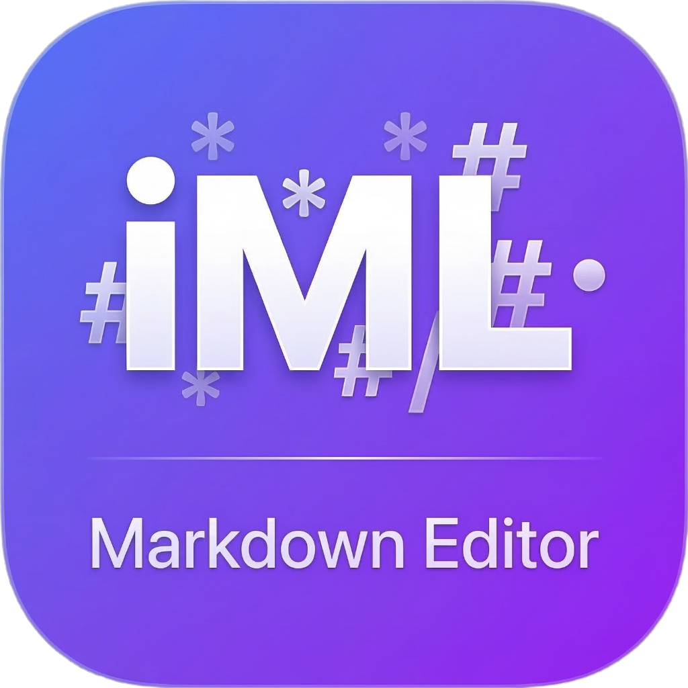

# iML Markdown Editor: Vibe Coding Studio

一款追求极致简洁、专业排版与 AI 灵感驱动的 Markdown 桌面编辑器。专为“从想法到现实”的快速跨越（Vibe Coding）而生。



## ✨ 核心特性

- **🪄 AI 场景灵感写作**：
  - **灵感转 PRD**：将模糊意愿 (Vibe) 转化为标准化的产品需求文档。
  - **AI Studio / Stitch 指令工程**：精准生成 Google AI Studio 与 Stitch 的高交互原型指令。
  - **Nano Banana PPT 视觉增效**：集成 10 套专业模板风格模式，智能推荐 PPT 大纲与配图 Prompt。
  - **智能导向输出**：首创“光标感知”逻辑，AI 生成内容可直接**原地流式录入**当前文档，或按需新建。
- **🔄 双模态自由切换**：
  - **富文本 (Word 模式)**：基于 Tiptap，提供所见即所得、极致丝滑的排版体验。
  - **源码 (Markdown 模式)**：基于 CodeMirror 6，提供高精度的实时代码编辑与预览。
- **💎 纯粹主义视觉设计**：
  - **Nordic Clarity 审美**：基于 Vibe Coding 理念重构的侧边 AI 面板与状态栏。
  - **沉浸式交互细节**：Glow 呼吸效果输入框、绿色状态呼吸灯，深度适配 macOS 原生毛玻璃背景。
- **📝 专业排版内核**：
  - 支持 GFM 标准表格、KaTeX 数学公式、代码高亮。
  - 内置 AI 文本处理：一键润色、总结、深度扩写。

## 🚀 快速开始

### 环境依赖
- Node.js (推荐 v18+)
- npm 或 yarn

### 运行开发环境
```bash
# 安装依赖
npm install

# 启动开发服务器
npm run dev
```

### 构建应用
```bash
# 生成分发包
npm run build:mac
```

## 🛠 技术架构
- **核心框架**: React + Vite
- **原生容器**: Electron
- **状态管理**: Zustand
- **编辑器内核**: Tiptap (Rich Text), CodeMirror 6 (Source)
- **AI 引擎**: 集成 Vibe Coding 深度提示词工程

## ⌨️ 常用快捷键
- `Cmd + N`: 新建文件
- `Cmd + O`: 打开文件
- `Cmd + S`: 保存文件
- `Cmd + E`: 切换编辑模式
- `Cmd + /`: 快捷键说明 (极致紧凑版，全量显示)

## 🔗 项目链接
- **GitHub**: [https://github.com/imoling/iml-markdown-editor](https://github.com/imoling/iml-markdown-editor)

## 📄 许可证
Logic & Design by [imoling.cn@gmail.com](mailto:imoling.cn@gmail.com) | Developed by Antigravity AI

&copy; 2026 iML Studio. **让书写回归纯粹，让愿景触手可及。**
