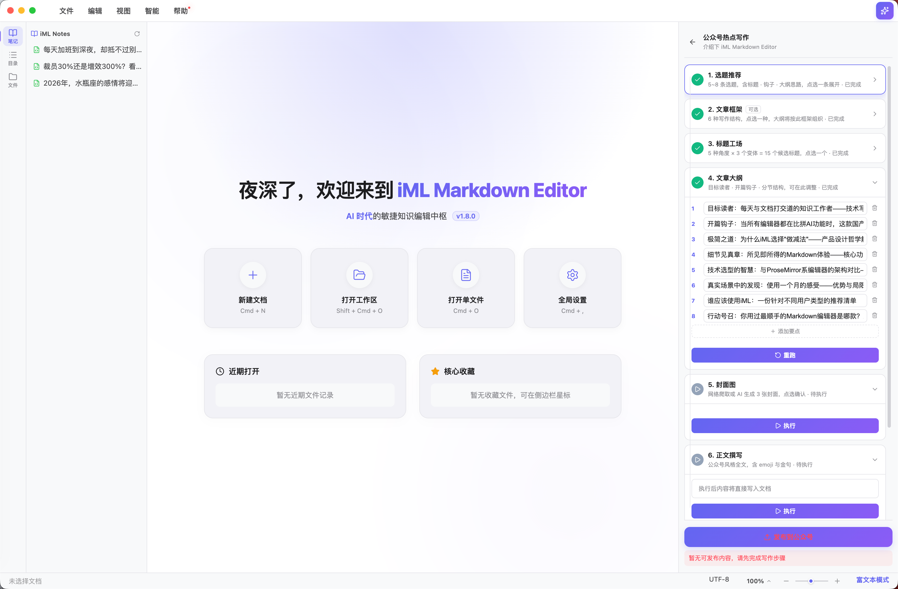

# iML Markdown Editor · [](https://github.com/imoling/iml-markdown-editor/releases)


**极简其表 · 极致内核**


---

本地 Markdown 编辑器，为长期写作和 AI 辅助创作设计。界面只保留必要的东西，剩下的交给快捷键和侧边栏。

v1.8.0 将 AI 写作重构为 Skill 体系——每个场景是一条独立的步骤化工作流，首发公众号热点写作：从联网选题到微信发布，9 步，不用切其他工具。

---

## 特性

### 🪄 公众号热点写作

9 步走完一篇公众号文章：

1. **选题推荐**：抓取 X / HN / GitHub 当日动态，给出 5~8 条选题方向，每条附标题、钩子句和大纲思路
2. **文章框架** `可选`：干货、故事、观点、测评、趋势、案例 6 种结构，选一种，后续大纲按它来
3. **标题工场**：5 个角度各出 3 条，共 15 个候选标题，点一个就锁定
4. **文章大纲**：目标读者、开篇钩子、分节结构，执行前可以手改
5. **封面图**：网络爬取或 AI 生成，每次出 3 张，点选确认
6. **正文撰写**：把选题、框架、标题一起喂进去，写出带 emoji 和金句的完整正文
7. **插图提示词** `可选`：读完正文，标出该放图的位置，给每处出一条文生图提示词
8. **润色定稿** `可选`：先静默读原文判断语气和风格，再按这个风格改，不会改成 AI 腔
9. **排版预览** `可选`：选主题色，输出微信兼容的 inline style HTML，可预览；「发布到公众号」一键推草稿箱，封面和插图自动上传



### 📁 文件管理

- 侧边栏右键：重命名、创建副本、新建子文档、推入废纸篓
- 独立笔记库 Tab，路径在设置里配，右键管理和文件面板一致
- 重启自动恢复上次的工作区、标签页、滚动位置
- 装好之后可以在 macOS「打开方式」里设为 `.md` 的默认编辑器
- `F2` 重命名 / `⌘D` 克隆 / `Backspace` 删除


### 🎨 编辑器

- 富文本和源码两种模式，`⌘E` 切换，底层分别是 Tiptap 2.0 和 CodeMirror 6
- Mermaid / SVG 实时渲染，图表高度可拖拽调整
- 图片生成接 Gemini / MiniMax / 豆包，也可以填自定义端点
- 接推理模型时自动过滤 `<think>` 块，不用手动清理


### 💡 Vibe Coding

用 iML 写 PRD，再交给 AI 编程工具——下面是"极简会议预订系统"的完整过程：


---

## 下载

| 平台 | 安装包 |
|---|---|
| macOS Apple Silicon（M 系列） | `iML.Markdown.Editor-x.x.x-arm64.dmg` |
| macOS Intel（x64）| `iML.Markdown.Editor-x.x.x-x64.dmg` |
| Windows | `iML.Markdown.Editor.Setup.x.x.x.exe` |

> v1.8.0 起同时提供 Apple Silicon 与 Intel 两个原生包，Intel Mac 用户请下载 `x64` 版本。

前往 [Releases](https://github.com/imoling/iml-markdown-editor/releases) 下载最新版本。

---

## 本地运行

```bash
npm install
npm run dev          # 开发模式
npm run build:mac    # macOS 安装包（同时生成 arm64 和 x64）
npm run build:win    # Windows 安装包
```

---

## 技术栈

| 层 | 技术 |
|---|---|
| Core | React 19 + Vite + TypeScript |
| Runtime | Electron（Main / Preload Bridge） |
| State | Zustand（本地持久化） |
| Editor | Tiptap 2.0 / CodeMirror 6 |
| AI | OpenAI-compatible API，流式输出，支持推理模型 |
| 发布 | 微信公众号 Draft API，Node.js 原生 HTTPS |

---

## 快捷键

| 动作 | 快捷键 |
|---|---|
| 新建 / 打开 / 保存 | `⌘N` / `⌘O` / `⌘S` |
| 另存为 | `⌘⇧S` |
| 切换编辑模式 | `⌘E` |
| 侧边栏显隐 | `⌘\` |
| 重命名 / 克隆 | `F2` / `⌘D` |
| 设置 | `⌘,` |

---

## 版本历史

**v1.9.0** — 公众号写作全链路升级

公众号写作新增"场景写作"模式：从脑暴想法出发，支持粘贴网页链接或上传文档作为参考素材，AI 提炼创作策略、生成候选标题、按选定框架写大纲，完整对齐热点写作流程。两套工作流均新增：文章框架选择（6 种结构模板）、标题工场（5 角度 × 3 变体 = 15 个候选）、插图提示词（JSON 卡片逐图展示）、结构诊断（4 维分卡片报告，供人工审核）、传播优化（搜一搜摘要发布时自动带入 digest 字段）、微信排版预览（自定义主题色，一键预览 + 复制 HTML）。润色完成后可一键"写入当前文档"。深度推理模型（DeepSeek R1 等）`<think>` 块自动过滤，联网搜索长查询改为 AI 提取关键词后再搜，避免超长 query 报错。

**v1.8.0** — Skill 化 AI 写作 & 公众号工作站
AI 写作重构为 Skill 体系：每个写作场景封装为独立的步骤化工作流，按需执行、可跳过、可重跑，告别单一大框的 prompt 模式。首发公众号热点写作 Skill，覆盖从联网选题到微信一键发布的完整 9 步流程。新增独立笔记库 Tab，支持右键管理与键盘快捷键。支持 macOS 文件关联，可设为 `.md` 默认编辑器。

**v1.7.0** — Knowledge Base
深度文件管理：侧边栏右键菜单（重命名、副本、子文档、废纸篓），星标收藏与访问记录。全局会话持久化：冷启动恢复所有标签页、工作区路径和滚动位置，窗口失焦自动存盘。新增毛玻璃 Dashboard 启动页。

**v1.6.0** — Windows 支持 & 图形引擎
首次支持 Windows 平台。新增 AI 生成 Mermaid / SVG 图，图形响应式缩放，修复 PDF 导出时图形丢失问题。新增"结合上下文"AI 补充文案能力。

**v1.5.0** — AI 写作助手
引入场景化 AI 面板，内置 Vibe Coding 工具链（PRD、技术方案、周报等）。AI 请求迁移至 Electron 主进程，绕过 CSP 限制，SSE 流式输出稳定性大幅提升。全站 Indigo-Purple 视觉重设计，毛玻璃侧边栏。新增自动检查更新。

**v1.0.0** — 首发
双模编辑（Tiptap 富文本 + CodeMirror Markdown）、侧边栏目录与文件导航、PDF 导出、macOS 原生体验。

---

## 许可证

[CC BY-NC 4.0](https://creativecommons.org/licenses/by-nc/4.0/) — 非商业使用。

Logic & Design by [imoling.cn@gmail.com](mailto:imoling.cn@gmail.com) | Architected with Antigravity AI

&copy; 2026 iML Studio

[](https://creativecommons.org/licenses/by-nc/4.0/)
