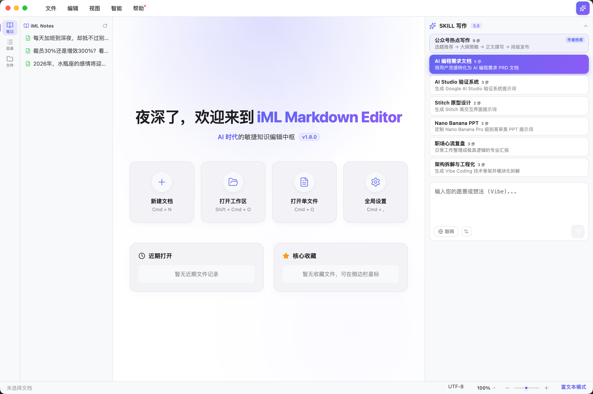
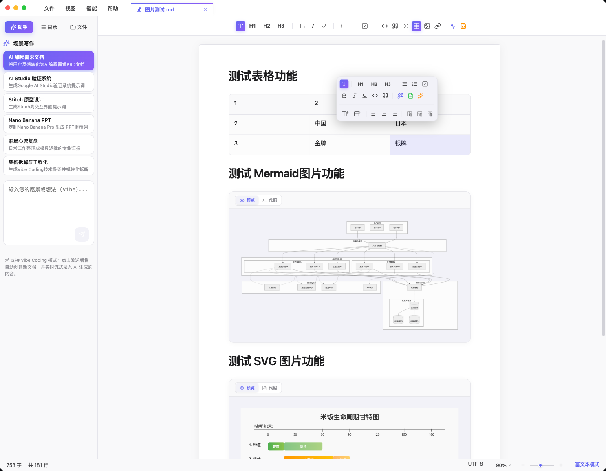
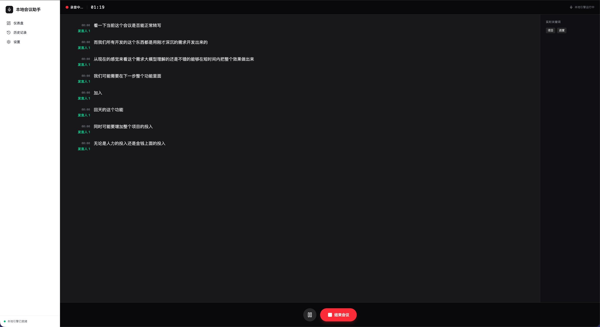
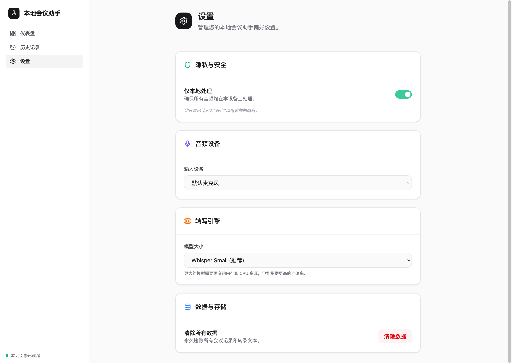

# iML Markdown Editor (v1.7.0)

**AI 时代的敏捷知识编辑中枢**
**极简其表 &middot; 极致内核** (Minimalist Surface, Maximalist Core).



## 🛡️ 核心哲学：灵感驱动，逻辑重塑
iML Markdown Editor 的诞生初衷，是让 **Vibe Coding 的第一步变得前所未有的简单**。

在 AI 编程时代，最大的挑战往往不是代码编写，而是如何将脑海中模糊的“灵感（Vibe）”转化为 AI 能够无损理解的“指令”。iML 旨在成为您与 AI 之间的最优接口，通过 **指令级 AI 助手** 与 **工程化文档系统**，让您的想象力能够毫无障碍地传递给 AI 编程工具。

作为一款根植于本地系统的编辑器，v1.7.0 版本更进一步，进化为具备**深度文件管理**能力的“知识管理库（Knowledge Base）”。它提供了极速的文件系统响应、专业的排版渲染以及丝滑的编辑体验，确保无论是在深度 AI 创作还是日常知识沉淀中，都能让您得心应手。

## ✨ 核心特性

### 🪄 AI 灵感驱动 (Knowledge Architect)
集成极致精简的 **指令级 AI 面板**，支持全链路流式生成，实现从灵感维度到标准 PRD/原型/文档的跨越：
- **常驻发送指令**：重新设计的 AI 气泡，具备实体感按钮与确认状态。
- **智能上下文引用**：一键引入文档大纲与全量内容，实现具备“逻辑深度”的内容润色。
- **AI 场景化工作室**：PRD 文档、Prompt 工程、Nano Banana 画图等深度集成。


*图：深度集成多种 Vibe Coding 写作场景*

### 📁 深度文件管理系统 (File Management)
- **原生级右键菜单**：侧边栏支持重命名、复制副本、新建子文档、推入回收站。
- **极客快捷键网格**：`F2` 重命名、`Cmd + D` 快速克隆、`Backspace` 快速删除。
- **会话持久化 (Session Restore)**：冷启动时自动恢复上次的工作区、已打开的标签页（Tabs）及滚动位置。


*图：功能强大的侧边栏文件管理与目录树*

### 🎨 沉浸式图表编辑 (Diagram Engine)
- **响应式图形引擎**：集成 Mermaid 与 SVG 实时渲染，支持 **拖拽式高度拉伸** 与等比缩放。
- **多模态实时预览**：在 MD 源码模式下支持侧边栏实时图表预览。


*图：Mermaid 与 SVG 实时可视化编辑*

### ⌨️ 专业级编辑能力
- **双模态无缝切换**：基于 Tiptap 2.0 (富文本) 与 CodeMirror 6 (源码模式)，支持物理隔离的交互体验。
- **纸张态沉浸排版**：视网膜级“白纸”交互图层，带来如同纸笔书写般的宁静感。


*图：极致清晰的 Markdown 源码编辑体验*

## 💡 Vibe Coding 实战示例：从灵感到全栈应用

使用 iML Markdown Editor 生成精准的 PRD 需求文档，并由 AI 编程工具自动开发完成的“极简会议预订系统”实战案例：


*图 1：实战案例 (1)*


*图 2：实战案例 (2)*


*图 3：实战案例 (3)*


*图 4：实战案例 (4)*

## 🚀 运行与构建

### 开发环境
```bash
# 安装依赖
npm install

# 启动开发服务器 (自动开启 Electron 容器)
npm run dev
```

### 生产构建
```bash
# 生成 Windows/Mac (x64/arm64) 安装包
npm run build
```

## 🛠 技术架构
- **Core**: React 19 + Vite + TypeScript
- **Runtime**: Electron (Main/Preload Bridge Layer)
- **State**: Zustand (Local Persistence Engine)
- **Engine**: Tiptap Gen-2 (Rich Text) / CodeMirror 6 (Markdown)
- **Styling**: Glassmorphism CSS Variables System

## ⌨️ 核心快捷键
| 动作 | 快捷键 |
|---|---|
| 新建 / 打开 / 保存 | `⌘ N` / `⌘ O` / `⌘ S` |
| 侧边栏重命名 / 克隆 | `F2` / `⌘ D` |
| 切换编辑模式 / 侧边栏 | `⌘ E` / `⌘ B` |
| 打开设置中心 / 关于 | `⌘ ,` / `⌘ I` |
| 另存为 | `⌘ ⇧ S` |

## 📄 许可证 & 愿景
本项目采用 [CC BY-NC 4.0](https://creativecommons.org/licenses/by-nc/4.0/) 许可证。未经授权，禁止商业用途。

Logic & Design by [imoling.cn@gmail.com](mailto:imoling.cn@gmail.com) | Architected with Antigravity AI

&copy; 2026 iML Studio. **极简其表，极致内核。让 AI 真正读懂你的 Vibe。**

[](https://creativecommons.org/licenses/by-nc/4.0/)