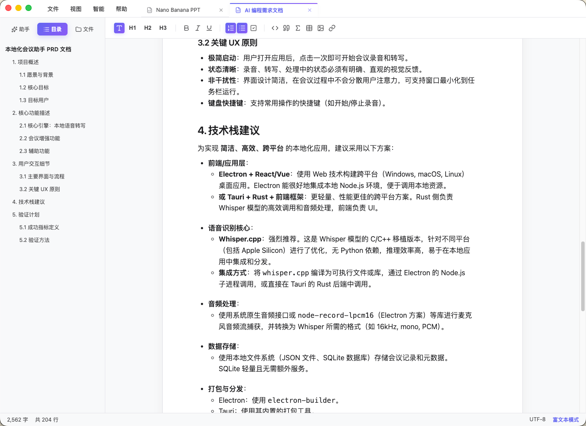

# iML Markdown Editor (v1.6.0)

一款为 **Vibe Coding** 时代打造的 AI 灵感编辑器。
**极简其表 &middot; 极致内核** (Minimalist Surface, Maximalist Core).


## 🛡️ 核心哲学：让灵感被 AI 精准理解
iML Markdown Editor 的诞生初衷，是让 **Vibe Coding 的第一步变得前所未有的简单**。

在 AI 编程时代，最大的挑战往往不是代码编写，而是如何将脑海中模糊的“灵感（Vibe）”转化为 AI 能够无损理解的“指令”。iML 旨在成为您与 AI 之间的最优接口，通过极致的编辑器体验与 **指令级 AI 助手**，让您的想象力能够毫无障碍地传递给 AI 编程工具。

当然，作为一款根植于本地系统的编辑器，iML 也是您处理本地 Markdown（.md）文件的得力助手。它提供了极速的文件系统响应、专业的排版渲染以及丝滑的编辑体验，确保无论是在深度 AI 创作还是日常文字记录中，都能让您得心应手。

## ✨ 核心特性

### 🪄 Vibe Coding AI 驱动 (The First Step)
集成极致精简的 **指令级 AI 面板**，支持全链路流式生成，即刻实现从灵感到实体的跨越：
- **常驻发送指令**：重新设计的 AI 气泡，具备实体感按钮与常驻发送确认，优化盲操体验。
- **结合上下文**：一键切换是否引入当前文档全量上下文进行精准生成。
- **AI 场景化写作**：PRD 文档、Google AI Studio Prompts、Stitch 原型、Nano Banana PPT 模板等深度集成。
- **工程化解构**：自动化将 Vibe Coding 创意拆解为标准技术骨架与模块化文档。

### 🎨 高端视觉与交互 (UI/UX)
- **纸张态沉浸排版**：富文本模式采用层次明晰的“白纸”交互图层，背景自适应深度增长，带来极致视网膜级的书写体验。
- **Modern Nordic Clarity**: 继承北欧简约设计，辅以 macOS 级原生地图、毛玻璃效果、以及丝滑的微动画。
- **极简标签管理**: 隐藏原生滚动条，支持活动标签自动居中，标签宽度根据负载智能收缩。
- **紧凑型交互弹窗**: 分页式快捷键详情（Shortcuts Modal），消除滚动条，按功能逻辑动态分布。
- **响应式图形预览**: 集成 Mermaid 与 SVG 实时渲染，支持 **拖拽式自由拉伸缩放** 与等比放大呈现。
- **全平台原生体验 (Cross-Platform)**: 
    - **macOS**: 完美适配 Apple Silicon (arm64)，具备原生交通灯控件与毛玻璃效果。
    - **Windows**: 提供深度定制的安装向导，支持 x64 与 arm64 双架构，并新增了原生感知的窗口控制按钮。

### ⌨️ 专业级编辑能力
- **双模态无缝切换**：
    - **富文本模式 (Rich Text)**：基于 Tiptap 2.0，支持 GFM 表格、气泡菜单引导与图片即时插入。
    - **源码模式 (Source Code)**：基于 CodeMirror 6，集成高性能实时预览、代码高亮与数学公式。
- **全场景安全审计**：实时追踪文档变更，针对新建文件与未保存更改提供三态（保存/不保存/取消）闭环保护。

## 📸 系统预览 (System Preview)


*图 1：主编辑界面*


*图 2：AI 写作面板*

## 💡 Vibe Coding 实战示例：从灵感到全栈应用

使用 iML Markdown Editor 生成精准的 PRD 需求文档，并由 AI 编程工具自动开发完成的“极简会议预订系统”实战案例：


*图 3：实战案例 (1)*


*图 4：实战案例 (2)*


*图 5：实战案例 (3)*

## 🚀 运行与构建

### 开发环境
```bash
# 安装依赖
npm install

# 启动开发服务器 (自动开启 Electron 容器)
npm run dev
```

### 生产构建
```bash
# 生成 macOS (arm64) 安装包
npm run build:mac

# 生成 Windows (x64/arm64) 安装包
npm run build:win
```

## 🛠 技术架构
- **Core**: React 18 + Vite + TypeScript
- **Runtime**: Electron (Main/Renderer Process Communication Layer)
- **State**: Zustand (Local Persistence)
- **Engine**: Tiptap (Rich Text) / CodeMirror 6 (Markdown)
- **Logic**: Node.js Native FS + Buffer-based SSE Streaming protocol
- **Styling**: Modern CSS Variables & Glassmorphism Design System

## ⌨️ 核心快捷键
| 动作 | 快捷键 |
|---|---|
| 新建 / 打开 / 保存 | `⌘ N` / `⌘ O` / `⌘ S` |
| 切换编辑模式 | `⌘ E` |
| 切换侧边栏 | `⌘ B` |
| 快捷键全览 | `⌘ /` |
| 另存为 | `⌘ ⇧ S` |

## 📄 许可证 & 愿景
本项目采用 [CC BY-NC 4.0](https://creativecommons.org/licenses/by-nc/4./) 许可证，未经授权，禁止将本项目用于任何商业目的。

Logic & Design by [imoling.cn@gmail.com](mailto:imoling.cn@gmail.com) | Architected with Antigravity AI

&copy; 2026 iML Studio. **极简其表，极致内核。让 AI 真正读懂你的 Vibe。**

[](https://creativecommons.org/licenses/by-nc/4.0/)