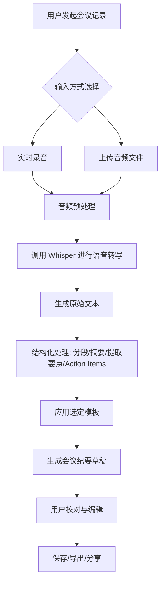

# PRD：基于 Whisper 的智能会议纪要产品

## 1\. 项目概述

### 1.1 灵感来源（Vibe）

用户的核心灵感是利用开源的 Whisper 自动语音识别（ASR）模型，开发一款能够自动、准确、高效地生成会议纪要的产品。旨在解决传统人工记录会议内容耗时耗力、信息易遗漏、会后整理繁琐等痛点，将与会者从繁重的记录工作中解放出来，专注于会议讨论本身。

### 1.2 核心目标与愿景

*   **核心目标**：打造一款轻量、易用、高精度的智能会议纪要生成工具，覆盖从会议录音到结构化纪要输出的完整流程。
    
*   **产品愿景**：成为团队和个人在会议场景下的“智能秘书”，通过 AI 技术提升信息流转效率与知识沉淀质量，让每一次会议的价值都被清晰记录和有效传承。
    

## 2\. 核心功能描述

### 2.1 核心功能模块

1.  **音频输入与处理**
    
    *   **实时录音**：在会议进行时，通过客户端（Web/桌面/移动端）直接录制音频流。
        
    *   **文件上传**：支持上传已录制的会议音频文件（如 mp3, wav, m4a 等常见格式）。
        
    *   **音频预处理**：自动降噪、音量均衡、语音增强（可选），以提升 Whisper 的识别准确率。
        
2.  **语音转写与识别**
    
    *   **Whisper 模型集成**：集成开源 Whisper 模型（建议提供多种模型尺寸选项，如 `base`, `small`, `medium`，以平衡速度与精度）。
        
    *   **多语言识别**：支持中英文及其他 Whisper 支持语言的自动识别与转写。
        
    *   **说话人分离（中期目标）**：结合第三方 VAD（语音活动检测）或说话人识别技术，尝试区分不同发言者（标记为“发言人 A”、“发言人 B”等）。
        
3.  **纪要生成与结构化**
    
    *   **文本格式化**：自动为转写文本添加标点、分段。
        
    *   **关键信息提取**：
        
        *   **自动摘要**：利用文本摘要模型（如基于 Transformer 的微调模型）生成会议内容概要。
            
        *   **议题/要点提取**：识别并罗列会议讨论的核心议题或决策要点。
            
        *   **待办事项（Action Items）识别**：通过关键词（如“需要”、“负责”、“下周前完成”）或模型识别会议中产生的任务，并提取负责人、截止时间等信息。
            
    *   **模板化输出**：提供多种纪要模板（如标准会议纪要、头脑风暴、评审会等），将原始文本、摘要、议题、待办事项自动填入。
        
4.  **编辑、管理与分享**
    
    *   **在线编辑器**：允许用户对 AI 生成的纪要进行校对、修改、补充。
        
    *   **纪要管理**：提供列表视图，可按时间、项目、标签对历史纪要进行管理。
        
    *   **导出与分享**：支持导出为 Markdown、Word、PDF、纯文本格式，并生成分享链接。
        

### 2.2 功能逻辑流程图

## 3\. 用户交互细节 (UX/UI 关键点)

### 3.1 核心交互流程

1.  **首页/仪表盘**：清晰的“开始录音”或“上传文件”按钮，下方展示最近的会议纪要列表。
    
2.  **录音界面**：
    
    *   极简设计，突出录音状态（波形图或动态图标）、计时器。
        
    *   提供“暂停/继续”、“标记重点”（可在时间点打标，便于后期回顾）功能。
        
    *   实时显示已识别出的文字流（可选功能，对性能有要求）。
        
3.  **处理与生成界面**：
    
    *   上传或录音结束后，自动跳转至处理页面，显示处理进度（如：转写中 -> 结构化中 -> 完成）。
        
    *   生成完成后，直接进入“编辑预览”模式，左侧为 AI 生成的各模块（原文、摘要、待办事项），右侧为最终纪要预览，用户可点击编辑任一模块。
        
4.  **编辑界面**：
    
    *   所见即所得的编辑体验，编辑任一模块，预览区实时同步。
        
    *   待办事项提供快速编辑组件（勾选完成、修改负责人、日期选择器）。
        

### 3.2 UI 设计原则

*   **简洁高效**：界面清晰，减少不必要的元素，聚焦于核心的录音、生成、编辑操作。
    
*   **状态可视**：音频处理状态（等待中、进行中、成功、失败）需明确反馈给用户。
    
*   **容错与引导**：上传文件格式错误、网络问题、处理失败等情况，应有友好的错误提示和解决建议。
    

## 4\. 技术栈建议

### 4.1 总体架构

采用前后端分离的架构，便于扩展和维护。

### 4.2 技术组件

*   **前端**：
    
    *   **框架**：React 或 Vue.js，构建动态良好的单页面应用（SPA）。
        
    *   **UI 库**：Ant Design 或 Element UI，加速开发。
        
    *   **音频处理**：Web Audio API 或第三方库（如 `wavesurfer.js`）用于录音和基础波形展示。
        
*   **后端**：
    
    *   **语言/框架**：Python + FastAPI（轻量、异步支持好，适合 AI 推理场景）。
        
    *   **核心 AI 服务**：
        
        *   **语音识别**：集成 `openai-whisper` 库。考虑使用 `faster-whisper`（基于 CTranslate2）以提升推理速度。
            
        *   **自然语言处理**：使用 `transformers` 库集成或微调文本摘要模型（如 BART, T5）。
            
    *   **任务队列**：使用 `Celery` + `Redis` 处理耗时的音频转写和 NLP 任务，实现异步处理，避免 HTTP 请求超时。
        
    *   **存储**：
        
        *   对象存储（如 MinIO 或云服务商 OSS/COS/S3）：存储用户上传的原始音频文件和生成的文档。
            
        *   数据库（如 PostgreSQL）：存储用户信息、会议纪要元数据、结构化内容。
            
*   **部署**：
    
    *   **容器化**：使用 Docker 封装应用及 Python 环境。
        
    *   **编排**：使用 Docker Compose（开发/小规模）或 Kubernetes（生产环境）。
        
    *   **模型部署**：可将 Whisper 模型单独部署，通过 gRPC 或 HTTP API 供后端服务调用，实现资源隔离和弹性伸缩。
        

## 5\. 验证计划

### 5.1 关键成功指标 (KSMs)

1.  **核心功能有效性**：
    
    *   **转写准确率**：在标准测试集（如中文会议音频样本）上的 WER（词错误率）达到可接受水平（例如，<15%）。
        
    *   **纪要生成满意度**：通过用户调研，对 AI 生成的摘要、要点提取、待办事项识别的有用性评分（如 5 分制平均分 > 3.5）。
        
2.  **用户体验**：
    
    *   **任务完成率**：从开始录音到成功导出纪要的用户流程完成率。
        
    *   **处理速度**：平均单小时音频文件的端到端处理时间（目标：接近或优于实时，如 1.2x 时长内）。
        
    *   **净推荐值 (NPS)**：收集早期用户的 NPS 分数。
        
3.  **产品采用**：
    
    *   **活跃用户数 (DAU/WAU)**。
        
    *   **功能使用频次**：平均每个用户每周生成的会议纪要数量。
        

### 5.2 验证阶段

1.  **Alpha 测试**：内部团队使用，验证核心转写与生成流程的稳定性和基础准确性。
    
2.  **Beta 测试**：邀请小范围外部友好用户（如 50-100 人），收集关于 UX、功能完整性和实际场景下准确性的反馈。
    
3.  **公开发布 (V1.0)**：基于测试反馈进行优化后，面向公众发布核心功能。持续监控上述 KSMs，并规划后续迭代（如说话人分离、更多模板、团队协作功能）。