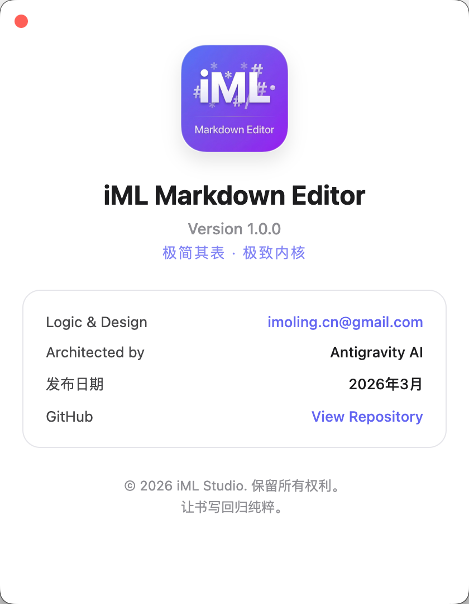
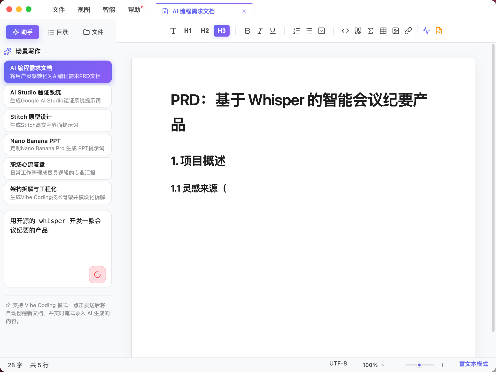
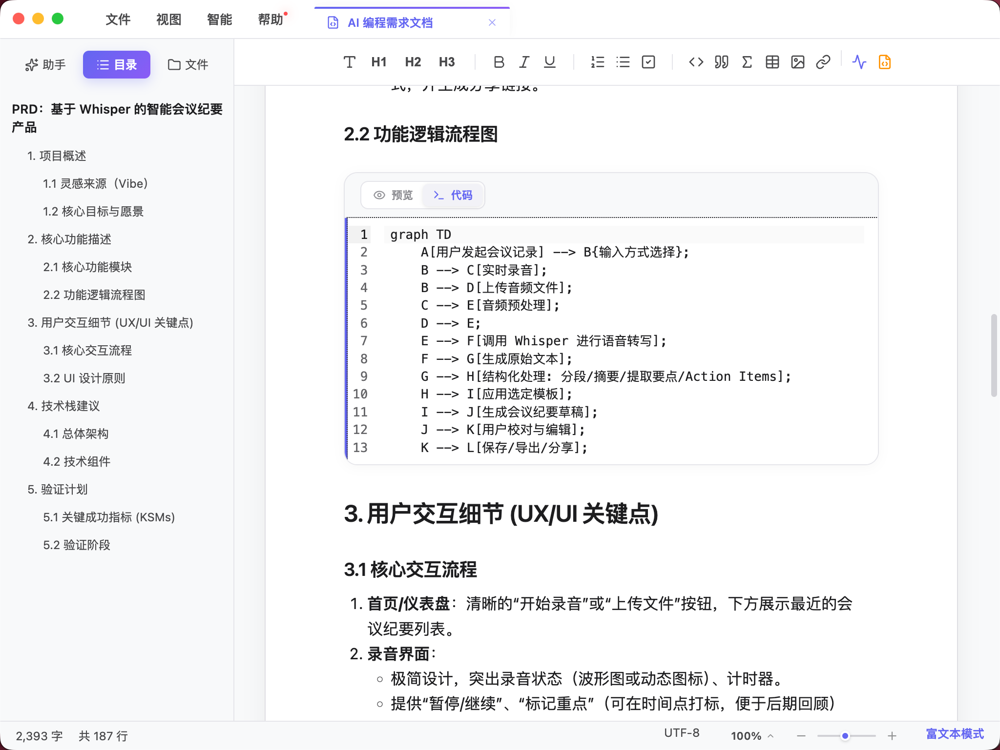
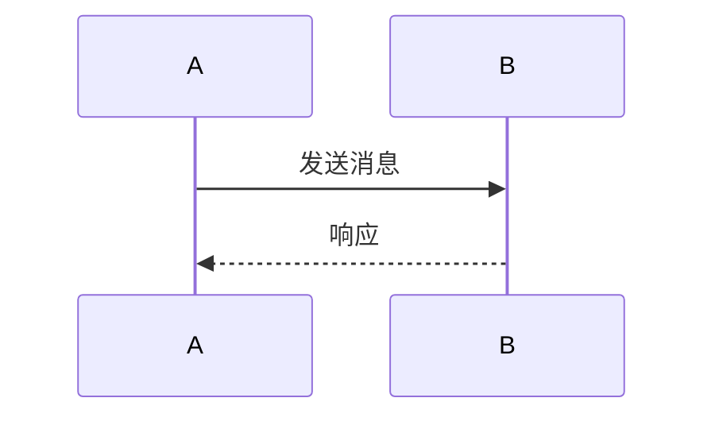
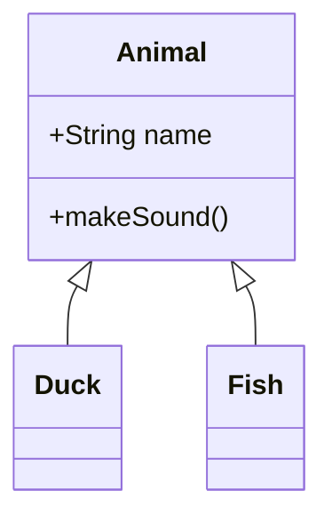
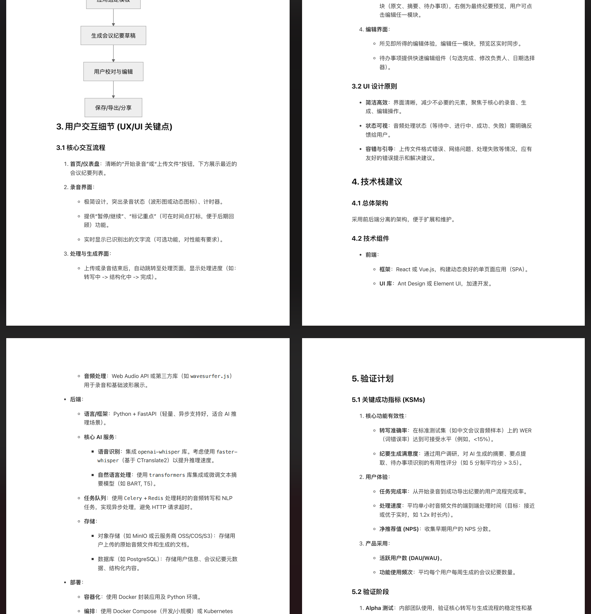

# iML Markdown Editor 使用手册


---

## 目录

1. [关于 iML](#关于-iml)
2. [安装与启动](#安装与启动)
3. [界面介绍](#界面介绍)
4. [基础操作](#基础操作)
5. [双模编辑](#双模编辑)
6. [AI 写作助手](#ai-写作助手)
7. [高级功能](#高级功能)
8. [导出与打印](#导出与打印)
9. [快捷键列表](#快捷键列表)

---

## 关于 iML

> **极简其表 · 极致内核** (Minimalist Surface, Maximalist Core)

iML Markdown Editor 是一款为 **Vibe Coding** 时代打造的 AI 灵感编辑器。

### 核心理念

在 AI 编程时代，最大的挑战往往不是代码编写，而是如何将脑海中模糊的"灵感（Vibe）"转化为 AI 能够无损理解的"指令"。iML 旨在成为您与 AI 之间的最优接口，通过极致的编辑器体验与**指令级 AI 助手**，让您的想象力能够毫无障碍地传递给 AI 编程工具。

### 核心特色

| 特色 | 说明 |
|------|------|
| **Vibe Coding AI 驱动** | 集成指令级 AI 面板，支持全链路流式生成，常驻发送按钮优化盲操体验 |
| **AI 场景化写作** | 深度集成 PRD 文档、Google AI Studio Prompts、Stitch 原型、Nano Banana PPT 模板等 |
| **双模态无缝切换** | 富文本模式（WYSIWYG）与源码模式一键切换 |
| **高端视觉体验** | 北欧简约设计，macOS 级原生毛玻璃效果与丝滑动画 |
| **全平台原生体验** | macOS 原生交通灯控件，Windows 深度定制安装向导 |

---

## 安装与启动

### 系统要求

- **macOS**: 11.0 (Big Sur) 或更高版本，推荐 Apple Silicon (arm64)
- **Windows**: Windows 10 或更高版本，支持 x64 与 arm64 双架构

### 安装

#### macOS 安装

1. 下载 `.dmg` 或 `.zip` 文件
2. 打开安装包，将 **iML Markdown Editor** 拖拽到「应用程序」文件夹
3. 首次启动时，在「应用程序」中找到应用，右键选择「打开」以绕过 Gatekeeper



#### Windows 安装

1. 下载 `.exe` 安装程序
2. 运行安装向导，按照提示完成安装
3. 可选择创建桌面快捷方式

### 启动

安装完成后，在应用程序列表中找到 **iML Markdown Editor** 并点击启动。

首次启动后，您将看到简洁的主界面：


---

## 界面介绍

### 主界面布局

iML 采用现代化的界面设计，继承北欧简约风格，辅以 macOS 级原生体验。

| 区域 | 说明 |
|------|------|
| **标题栏** | 包含菜单栏、标签页、窗口控制按钮（Mac 原生交通灯） |
| **工具栏** | 格式化按钮、快速操作入口 |
| **侧边栏** | 文件浏览器、智能目录大纲 |
| **编辑区** | 主要编辑区域，支持双模编辑 |
| **状态栏** | 行号、字数统计、当前模式指示 |

### 界面特色

- **纸张态沉浸排版**：富文本模式采用层次明晰的"白纸"交互图层，带来极致视网膜级的书写体验
- **极简标签管理**：隐藏原生滚动条，支持活动标签自动居中，标签宽度根据负载智能收缩
- **紧凑型交互弹窗**：分页式快捷键详情，按功能逻辑动态分布

---

## 基础操作

### 文件菜单


| 功能 | 快捷键 | 说明 |
|------|--------|------|
| 新建文件 | `⌘ N` | 创建新的 Markdown 文档 |
| 打开文件 | `⌘ O` | 打开本地 Markdown 文件 |
| 打开文件夹 | - | 打开文件夹作为工作区 |
| 保存 | `⌘ S` | 保存当前文件 |
| 另存为 | `⌘ ⇧ S` | 将文件另存为新文件 |
| 导出 PDF | - | 将文档导出为 PDF 格式 |
| 退出 | `⌘ Q` | 关闭应用程序 |

### 视图菜单


| 功能 | 快捷键 | 说明 |
|------|--------|------|
| 切换侧边栏 | `⌘ B` | 显示/隐藏侧边栏 |
| 切换工具栏 | - | 显示/隐藏工具栏 |
| 切换状态栏 | - | 显示/隐藏状态栏 |
| 切换编辑模式 | `⌘ E` 或 `⌘ ⇧ M` | 在 WYSIWYG/源码模式间切换 |

### 智能菜单


智能菜单是 iML 的核心特色，提供强大的 AI 写作能力：

| 功能 | 说明 |
|------|------|
| 场景写作 | 打开 AI 场景写作面板，预设多种专业场景 |
| 模型配置 | 配置 AI 模型参数，包括 API Key、模型选择等 |

### 帮助菜单


| 功能 | 说明 |
|------|------|
| 快捷键 | 查看所有快捷键 |
| 检查更新 | 检查软件更新 |
| 关于 | 查看版本信息 |

---

## 双模编辑

iML Markdown Editor 最核心的功能之一是**双模态无缝切换**，让您可以自由选择编辑方式。

### WYSIWYG 模式（富文本模式）


在 WYSIWYG（所见即所得）模式下，您可以像使用 Word 一样直接编辑文档，直观便捷。

#### 工具栏功能

编辑器工具栏提供丰富的格式化按钮：

- **文本格式**
  - 粗体 (`⌘ B`)
  - 斜体 (`⌘ I`)
  - 下划线 (`⌘ U`)
  - 删除线
  - 行内代码

- **段落格式**
  - 标题（H1-H6）
  - 引用
  - 代码块
  - 水平线

- **列表**
  - 有序列表
  - 无序列表
  - 任务列表（支持复选框）

- **插入**
  - 链接
  - 图片（支持拖拽插入）
  - 表格
  - 数学公式

- **对齐**
  - 左对齐
  - 居中
  - 右对齐
  - 两端对齐

#### 气泡菜单

在 WYSIWYG 模式下，选中文本后会弹出气泡菜单，提供快速格式化选项。

### 源码模式

源码模式基于 CodeMirror 6，提供高性能的 Markdown 编辑体验：

- **语法高亮**：精准的 Markdown 语法着色
- **实时预览**：右侧实时预览渲染效果
- **代码补全**：自动补全 Markdown 语法

### 切换模式

- 点击工具栏中的切换按钮
- 使用快捷键 `⌘ E`（macOS）或 `Ctrl+E`（Windows）
- 使用快捷键 `⌘ ⇧ M`（macOS）或 `Ctrl+Shift+M`（Windows）

---

## AI 写作助手

iML Markdown Editor 的核心特色之一是深度集成的 **Vibe Coding AI 驱动**，让 AI 成为您写作的得力助手。

### 两种触发方式

#### 方式一：空格触发 AI 续写


在编辑器中输入内容后，按下**空格键**即可触发 AI 浮窗：

| 功能 | 说明 |
|------|------|
| **续写** | 根据当前内容智能续写，保持思路连贯 |
| **润色** | 优化当前段落表达，使文字更专业 |
| **解释** | 解释选中内容，适合技术术语 |
| **翻译** | 翻译选中的外语文本 |

**特色设计**：
- 重新设计的 AI 气泡，具备实体感按钮
- 常驻发送确认，优化盲操体验
- 一键切换是否引入当前文档全量上下文进行精准生成

#### 方式二：选中内容智能处理


选中文本后点击右键，弹出智能菜单：

| 功能 | 说明 |
|------|------|
| **AI 写作** | 对选中内容进行 AI 处理（续写、润色、扩展） |
| **解释** | 解释选中内容 |
| **翻译** | 翻译选中文本 |

### 场景化写作



点击「智能 > 场景写作」打开 AI 场景写作面板，提供多种预设场景：

| 场景 | 适用场景 |
|------|----------|
| 博客写作 | 技术博客、个人文章、教程 |
| 商业邮件 | 商务邮件、工作汇报 |
| 社交媒体 | 微博、小红书、推文 |
| 技术文档 | API 文档、README、开发指南 |
| PRD 需求 | 产品需求文档、功能规格 |
| AI Prompts | AI 提示词优化 |

#### 工程化解构

iML 的独特之处在于能够自动化将 Vibe Coding 创意拆解为标准技术骨架与模块化文档，帮助您将模糊的灵感转化为可执行的指令。

### 模型配置


点击「智能 > 模型配置」可以配置 AI 功能：

| 参数 | 说明 |
|------|------|
| **模型选择** | 选择使用的 AI 模型 |
| **API Key** | 输入您的 API 密钥（需自行配置） |
| **Temperature** | 控制生成内容的随机性（0-2） |
| **最大令牌数** | 限制单次生成内容的长度 |

> **注意**：使用 AI 功能需要您自行配置 API Key。iML 不会收集您的密钥，所有请求直接发送到您的 AI 服务商。

---

## 高级功能

### 智能目录


侧边栏自动提取文档中的标题（`#` H1 至 `######` H6），生成可点击的文档大纲。

**使用方式**：

1. 确保侧边栏可见（视图菜单 → 切换侧边栏，或 `⌘ B`）
2. 在文档中使用 Markdown 标题语法
3. 侧边栏自动更新目录结构
4. 点击目录项即可快速跳转到对应位置

### 表格支持

编辑器完整支持 GFM（GitHub Flavored Markdown）表格语法：

```markdown
| 标题1 | 标题2 | 标题3 |
|-------|-------|-------|
| 内容1 | 内容2 | 内容3 |
| 内容4 | 内容5 | 内容6 |
```

**操作方式**：

- 工具栏插入表格按钮
- 拖拽调整行列数
- 支持在 WYSIWYG 模式下直接编辑

### 任务列表

支持 Markdown 任务列表语法：

```markdown
- [ ] 未完成任务
- [x] 已完成任务
```

### 数学公式

支持 LaTeX 数学公式渲染：

| 类型 | 语法 | 效果 |
|------|------|------|
| 行内公式 | `$E=mc^2$` | $E=mc^2$ |
| 独立公式 | `$$E=mc^2$$` | $$E=mc^2$$ |
| 复杂公式 | `$$\int_0^\infty e^{-x^2} dx$$` | $$\int_0^\infty e^{-x^2} dx$$ |

### Mermaid 图表



支持使用 Mermaid 语法绘制各类图表：

#### 流程图


#### 时序图



#### 类图



**编辑器特色**：

- 独立的图表代码编辑区域
- 实时预览渲染效果
- 响应式图形预览，支持拖拽式自由拉伸缩放

---

## 导出与打印

### PDF 导出



将 Markdown 文档导出为 PDF 格式，保留原有格式和样式。

**导出步骤**：

1. 点击「文件 > 导出 PDF」
2. 选择保存位置和文件名
3. 点击保存

**PDF 特色**：

- 多种主题样式
- 代码高亮显示
- 数学公式完整渲染
- Mermaid 图表矢量呈现
- 清晰的目录结构

---

## 快捷键列表


### 文件操作

| macOS | Windows | 功能 |
|-------|---------|------|
| `⌘ N` | `Ctrl N` | 新建文件 |
| `⌘ O` | `Ctrl O` | 打开文件 |
| `⌘ S` | `Ctrl S` | 保存文件 |
| `⌘ ⇧ S` | `Ctrl Shift S` | 另存为 |
| `⌘ Q` | `Ctrl Q` | 退出 |

### 编辑操作

| macOS | Windows | 功能 |
|-------|---------|------|
| `⌘ Z` | `Ctrl Z` | 撤销 |
| `⌘ ⇧ Z` | `Ctrl Shift Z` | 重做 |
| `⌘ X` | `Ctrl X` | 剪切 |
| `⌘ C` | `Ctrl C` | 复制 |
| `⌘ V` | `Ctrl V` | 粘贴 |
| `⌘ F` | `Ctrl F` | 查找 |
| `⌘ H` | `Ctrl H` | 替换 |
| `⌘ /` | `Ctrl /` | 切换注释 |

### 视图操作

| macOS | Windows | 功能 |
|-------|---------|------|
| `⌘ B` | `Ctrl B` | 切换侧边栏 |
| `⌘ E` | `Ctrl E` | 切换编辑模式 |
| `⌘ ⇧ M` | `Ctrl Shift M` | 切换编辑模式 |
| `⌘ +` | `Ctrl +` | 放大字体 |
| `⌘ -` | `Ctrl -` | 缩小字体 |
| `⌘ 0` | `Ctrl 0` | 重置字体大小 |

### 格式化

| macOS | Windows | 功能 |
|-------|---------|------|
| `⌘ B` | `Ctrl B` | 粗体 |
| `⌘ I` | `Ctrl I` | 斜体 |
| `⌘ U` | `Ctrl U` | 下划线 |
| `⌘ ` | `` Ctrl ` `` | 行内代码 |

---

## 技术支持

- **官方网站**: [GitHub](https://github.com/imoling/iml-markdown-editor)
- **问题反馈**: [Issues](https://github.com/imoling/iml-markdown-editor/issues)
- **邮箱**: imoling.cn@gmail.com

---

## 许可证

本项目采用 [CC BY-NC 4.0](https://creativecommons.org/licenses/by-nc/4.0/) 许可证，未经授权，禁止将本项目用于任何商业目的。

---

*文档版本: 1.6.0*
*最后更新: 2026-03-18*
